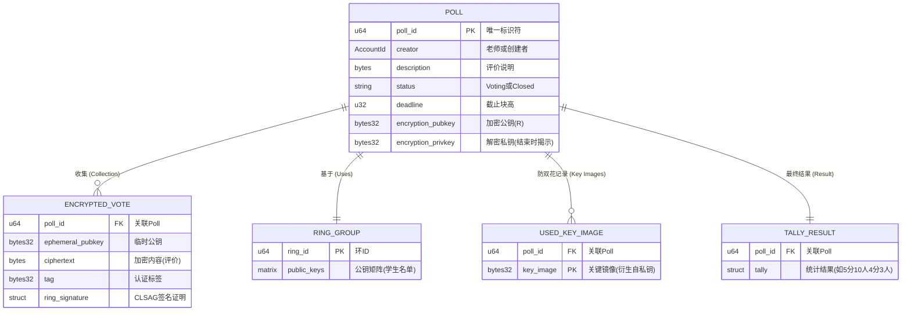

# 环签名匿名投票系统文档 (Ring Sig Voting Documentation)

## 1\. 系统上下文 (System Context)

本系统实现了一个基于 Substrate 的去中心化匿名评价系统。以“教学评价”为例：

  * **老师 (Teacher/Creator)**：创建评价问卷，设定截止日期，并掌握解密私钥（但在评价结束前不能查看内容）。
  * **学生 (Student/Voter)**：使用环签名技术提交评价。系统可以验证“这是某个学生的真实评价”，但无法追踪“具体是哪位学生”。
  * **管理员 (Ring Admin)**：维护合法的公钥环（即合法的学生名单）。
  * **区块链 (Blockchain)**：作为可信的时间戳和验证层，防止双重评价，并在结束时验证统计结果的合法性。

<!-- end list -->

-----

## 2\. 评价生命周期 (Poll Lifecycle)

评价 (Poll) 的状态机非常简洁，只有两个状态：`Voting` (进行中) 和 `Closed` (已结束)。设计重点在于状态转换时的强制校验。

  * **创建时**：状态立即变为 `Voting`，并锁定押金。
  * **投票期间**：接收加密选票，检查 Key Image 防止双花。
  * **关闭时**：必须提供与创建时公钥匹配的私钥，同时提交链下计算好的 Tally 结果。

<!-- end list -->

-----

## 3\. 详细交互流程 (Detailed Interactions)

### 3.1 准备阶段 (Setup Phase)

此阶段确立了“谁可以投票”（通过 Ring）以及“投票的加密参数”（通过 Poll Creation）。

### 3.2 投票阶段 (Voting Phase) - 核心逻辑

这是系统最复杂的部分。为了保护隐私，大部分加密计算在客户端（学生端）完成。链上只负责验证零知识证明（环签名）和防重放。

**关键点说明**：

  * **ECIES 加密**：学生使用 `Poll PubKey` 和自己生成的 `Ephemeral Key` 进行 ECDH 协商，加密评价内容。
  * **Linkable Ring Signature (CLSAG)**：
      * **Anonymity**: 签名证明了“我是 Ring 中的一员”。
      * **Linkability**: 生成唯一的 `Key Image`。如果同一个私钥尝试第二次签名，会生成相同的 `Key Image`，链上会拒绝。

<!-- end list -->

### 3.3 结算阶段 (Settlement Phase) - 乐观计票

按照你的代码逻辑，计票由 Creator 在链下完成，链上验证解密权限。

-----

## 4\. 数据模型与存储 (Data Model & Storage)

为了支持上述的匿名投票流程，链上存储设计必须兼顾“隐私保护”和“可验证性”。以下实体关系图 (ER Diagram) 展示了各个存储单元 (StorageMap) 之间的逻辑关联。

**设计亮点**：

  * **解耦设计**：`RingGroups`（公钥环）与 `Polls`（评价/投票）分离。同一个学生名单（班级）可以被多个评价复用，节省存储空间。
  * **双花防范**：`UsedKeyImages` 绑定了 `PollId` 和 `KeyImage`。这意味着同一个学生可以在“期中评价”和“期末评价”中分别投票，但在同一个评价中只能投一次。

<!-- end list -->

-----

## 5\. 接口与 API (Integration & API)

本节主要面向前端开发者。为了完成一次完整的评价流程，前端需要依次调用以下 Extrinsics（外部交易），并监听相应的 Events（事件）。

### 5.1 核心交易 (Extrinsics)

| 方法名 (Method) | 角色 | 参数说明 (Parameters) | 功能描述 |
| :--- | :--- | :--- | :--- |
| **`register_ring_group`** | Admin | `ring: Vec<Vec<Pubkey>>` | **注册班级名单**。 提交一组学生的公钥，生成一个 `RingId`。这是为了复用名单，避免每次投票都上传几百个公钥。 |
| **`create_poll`** | Teacher | `desc: Bytes` `ring_id: u64` `deadline: BlockNum` `pubkey: [u8;32]` | **发起评价**。 指定使用的班级 (`ring_id`) 和加密用的公钥。需支付押金。 |
| **`anonymous_vote`** | Student | `poll_id: u64` `ciphertext: Bytes` `auth_tag: [u8;16]` `signature: CLSAG` | **提交匿名评价**。 核心逻辑：前端生成临时密钥加密内容，并计算环签名。如果验证通过，票会被记录。 |
| **`close_poll`** | Teacher | `poll_id: u64` `privkey: [u8;32]` `tally: TallyType` | **结束评价**。 老师在本地解密所有选票，统计结果，然后将私钥和结果上链。链上验证私钥匹配后，公示结果。 |

### 5.2 关键事件 (Events)

前端应当监听这些事件以更新 UI 状态。

-----

## 6\. 技术栈与密码学参数 (Tech Stack & Crypto Specs)

为了确保集成的兼容性，以下是系统使用的具体密码学参数：

  * **椭圆曲线 (Curve)**: `Ristretto255` (基于 Curve25519 的素数阶群，杜绝了 cofactor 问题)。
  * **环签名方案 (Ring Signature)**: `CLSAG` (Compact Linkable Spontaneous Anonymous Group Signature)。
      * *特性*: 签名大小较小，验证速度快，且具备可链接性 (Linkability)。
  * **加密方案 (Encryption)**: `ECIES` 变体。
      * 使用 `Ristretto255` 点进行 Diffie-Hellman 密钥交换。
      * 派生出的对称密钥用于加密评价内容 (Payload)。
  * **哈希算法 (Hash)**: `SHA-512` (用于将点映射到标量) 和 `Blake2` (用于 Substrate 存储哈希)。

-----

## 7\. 安全性与局限性 (Security & Limitations)

### 7.1 安全假设

1.  **匿名性 (Anonymity)**: 只要环中至少有一个其他成员是诚实的，攻击者就无法以显著高于随机猜测的概率确定签名者。
2.  **不可伪造性 (Unforgeability)**: 只有拥有对应公钥私钥的人才能生成有效的环签名。
3.  **可链接性 (Linkability)**: 同一私钥对同一消息（上下文）的两次签名必然产生相同的 Key Image。

### 7.2 已知局限 (Current Limitations)

  * **链下计票信任模型**: 目前系统的计票结果 (`Tally`) 是由创建者在链下计算并提交的。虽然链上强制揭示了私钥，允许任何人事后验证计票的正确性（**可审计**），但如果创建者故意提交错误的 Tally，需要依赖社区的监督和举报机制（或者在未来版本中引入 ZK-Proof 来证明计票正确性）。
  * **扩展性**: 环签名的大小与环成员数量呈线性关系 (Linear Size)。对于几百人的班级评价完全没问题，但如果扩展到数万人的全校投票，交易体积会变大，可能需要考虑更高阶的零知识证明方案 (如 zk-SNARKs)。
